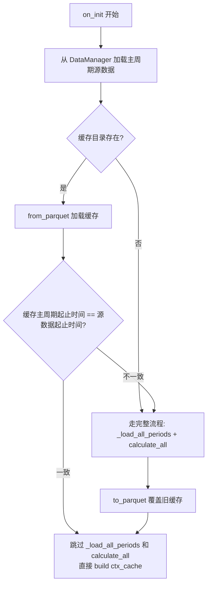

## 用户需求

回测时将 DataFeed（含 OHLCV + 指标列 + events）保存为 Parquet 缓存。下次回测时校验缓存是否与源数据一致（比较主周期起止时间），一致则直接加载跳过 calculate_all，不一致则全量重算并覆盖旧缓存。

## 核心功能

- **保存**：`DataFeed.to_parquet(cache_dir)` 将每个周期的完整 DataFrame + events DataFrame + 元数据 JSON 写入一个目录
- **加载**：`DataFeed.from_parquet(cache_dir)` 从 parquet 文件恢复完整 DataFeed 实例，包括周期数据、events、指标配置和已计算标记
- **缓存校验**：Bridge 比较缓存主周期的起止时间与 DataManager 源数据起止时间，一致则加载，不一致则重算覆盖

## 技术栈

- Python 3.10+
- pandas（已有）
- pyarrow（新增依赖，Parquet 读写引擎）

## 实现方案

### 整体思路

在 `DataFeed` 类中新增 `to_parquet(cache_dir)` 和 `from_parquet(cache_dir)` 两个方法，实现完整的序列化/反序列化。DataFeed 只负责读写，不做缓存有效性决策。决策在 Bridge 层：从 DataManager 加载源数据取出主周期起止时间，与缓存中主周期 parquet 的起止时间比对，一致则走缓存分支，不一致则走完整计算分支并覆盖旧缓存。

### 缓存目录结构

```
output/cache/
└── DCE.m2509/
    ├── _meta.json          # symbol, source, periods, indicators 配置
    ├── 1m.parquet          # index=datetime, columns=open/high/low/close/volume + sma_5 + sma_20 + ...
    ├── 5m.parquet
    └── events.parquet      # columns=type, symbol, reason, period, data
```

### 核心设计决策

1. **每个周期一个 parquet + 一个 events.parquet**：每个周期的 `PeriodData._df` 写为 `{period}.parquet`，`_events` DataFrame 写为 `events.parquet`。单个 parquet 即一张完整表。

2. **`_meta.json` 记录元数据**：symbol、source、periods 列表、每个周期注册的指标（name+params），用于恢复 `_registered_indicators` 和指标计算标记。

3. **`from_parquet` 为 classmethod**：先创建 DataFeed 实例再填充数据。

4. **指标计算状态恢复**：加载 parquet 后遍历 DataFrame 列，非 OHLCV 列（`['open','high','low','close','volume']` 之外）视为指标列，调用 `period_data.mark_indicator_calculated(col, len(df)-1)` 标记已计算。

5. **缓存校验用起止时间**：Bridge 拿到 DataManager 源数据的 DataFrame，取其 `index[0]` 和 `index[-1]` 作为源起止时间。加载缓存后取主周期 `_df.index[0]` / `_df.index[-1]` 作为缓存起止时间。两者一致则缓存有效，否则重算。

6. **`PeriodData.load_df_parquet(df, indicator_columns)`**：新增方法，一行完成 `load_df(df, replace=True)` + 逐个指标列 `mark_indicator_calculated()`。

### Bridge 层决策流程



### 性能分析

- 写入：`df.to_parquet()` 万行级数据 ~20-50ms，回测结束时执行一次
- 读取：`pd.read_parquet()` ~10-20ms，比 `calculate_all()` 快数十到数百倍
- 缓存命中时完全跳过 DataManager CSV 加载 + 指标计算

## 实现要点

### DataFeed.to_parquet(cache_dir)

1. 创建 `cache_dir` 目录
2. 构建 `_meta.json`（symbol / source / periods 列表 / 每个周期的 indicators 配置）
3. 写 `_meta.json`
4. 遍历 `self._periods`，每个周期 `period_data._df` 写 `{period_name}.parquet`
5. `self._events` 非空时写 `events.parquet`

### DataFeed.from_parquet(cache_dir) -> DataFeed

1. 读 `_meta.json`，获取 symbol、source、periods、indicators
2. 创建 `DataFeed(symbol=symbol)`
3. 遍历 periods，`pd.read_parquet(f"{cache_dir}/{pn}.parquet")` 读入，调 `period_data.load_df_parquet(df, indicator_cols)`
4. 恢复 `_registered_indicators` 字典
5. 若 `events.parquet` 存在，读入赋给 `self._events`
6. 返回完整 DataFeed 实例

### PeriodData.load_df_parquet(df, indicator_columns)

```python
def load_df_parquet(self, df: pd.DataFrame, indicator_columns: list[str]) -> None:
    self.load_df(df, replace=True)
    for col in indicator_columns:
        if col in self._df.columns:
            self.mark_indicator_calculated(col, len(self._df) - 1)
```

### VnpyBacktestBridge.on_init 改动

```python
# 从 DataManager 取源数据起止时间
dm = DataManager()
src_results = dm.load_kline([self._state.symbol], interval=self._state.period)
src_df = src_results[0][1]
src_start = src_df['datetime'].iloc[0] if len(src_df) > 0 else None
src_end = src_df['datetime'].iloc[-1] if len(src_df) > 0 else None

cache_dir = f"output/cache/{self._state.symbol}"
cache_valid = False
if os.path.isdir(cache_dir):
    try:
        cached_feed = DataFeed.from_parquet(cache_dir)
        main_pd = cached_feed.get_period(self._state.period)
        if main_pd is not None and src_start is not None:
            cache_start = main_pd._df.index[0]
            cache_end = main_pd._df.index[-1]
            if pd.Timestamp(src_start) == cache_start and pd.Timestamp(src_end) == cache_end:
                data_feed = cached_feed
                cache_valid = True
    except Exception:
        pass  # 缓存损坏，走完整流程

if not cache_valid:
    data_feed = DataFeed(symbol=self._state.symbol)
    # register periods/indicators（现有逻辑）
    self._load_all_periods(data_feed)
    data_feed.calculate_all()
    data_feed.to_parquet(cache_dir)

self._data_feed = data_feed
# build ctx_cache（现有逻辑）
```

## 目录结构

本次改动涉及的文件：

```
quant/
├── pyproject.toml                              # [MODIFY] 新增 pyarrow>=14 依赖
├── strategies/
│   └── runtime/
│       ├── period.py                           # [MODIFY] 新增 load_df_parquet 方法
│       ├── data_feed.py                        # [MODIFY] 新增 to_parquet/from_parquet 方法
├── strategies/
│   └── bridges/
│       └── vnpy_bridge.py                      # [MODIFY] on_init 加入缓存校验与加载分支
```

## Agent Extensions

### Skill

- **quant-dev**
- 目的：确保实现符合 quant 项目的架构约定、symbol 格式规范和 DataFeed/PeriodData 内部 API 使用方式
- 预期结果：生成的代码与现有 `vnpy_bridge.py` 中访问 `period_data._df` 的模式一致，遵循项目代码风格

### SubAgent

- **code-explorer**
- 目的：确认 `PeriodData` 类中 `mark_indicator_calculated`、`load_df` 方法签名，以及 `DataManager.load_kline` 返回格式
- 预期结果：确认所有需要调用的 API 参数格式，避免运行时类型错误