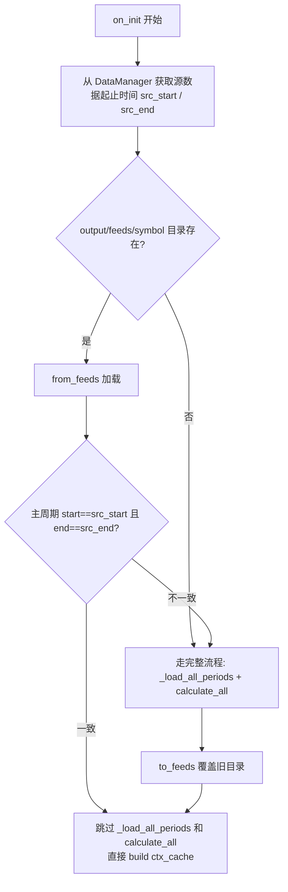

## 用户需求

回测时把 DataFeed（含 OHLCV + 已计算指标列 + events 表）整体保存为 Parquet 格式的 feeds，下次回测直接从 feeds 加载，跳过 `calculate_all()` 的指标重算。

## 核心功能

- **保存**：`DataFeed.to_feeds(dir_path)` 将每个周期的完整 DataFrame（OHLCV + 指标列）写为一个 parquet 文件，events 表写为 `events.parquet`，元数据写为 `_meta.json`
- **加载**：`DataFeed.from_feeds(dir_path)` 从 parquet 文件恢复完整 DataFeed 实例，包括周期数据、events、指标配置和已计算标记
- **校验**：Bridge 比较 feeds 中主周期的起止时间与 DataManager 源数据的起止时间，一致则直接加载，不一致则全量重算并覆盖旧 feeds

## feeds 目录结构

```
output/feeds/DCE.m2509/
├── _meta.json       # symbol, source, periods列表, indicators配置
├── 1m.parquet       # index=datetime, columns=open/high/low/close/volume/sma_5/sma_20/...
├── 5m.parquet
└── events.parquet   # columns=type, symbol, reason, period, data
```

## 技术栈

- Python 3.10+
- pandas >= 2.0（已有）
- pyarrow >= 14（新增依赖，Parquet 读写引擎）

## 实现方案

### 整体思路

在 `DataFeed` 类中新增 `to_feeds(dir)` 和 `from_feeds(dir)` 两个方法，实现完整的序列化/反序列化。DataFeed 只负责读写，不做有效性决策。决策在 Bridge 层：从 DataManager 获取源数据起止时间，与 feeds 中主周期 parquet 的起止时间比对，一致走缓存分支，不一致走完整计算分支。

### 核心设计决策

1. **每个周期一个 parquet + events.parquet + _meta.json**

- 每个 parquet 就是一张完整表，直接 `pd.read_parquet()` 反序列化
- OHLCV 列：`['open', 'high', 'low', 'close', 'volume']`，其余列为指标列
- events 是 DataFrame，同样用 parquet 存储

2. **指标计算状态恢复**

- 加载 parquet 后，非 OHLCV 列识别为指标列
- 调 `period_data.mark_indicator_calculated(col, len(df)-1)` 标记已计算
- `calculate_all()` 检测到已计算标记后自动跳过

3. **`from_feeds` 为 classmethod**

- 先创建 DataFeed 实例 → 读 `_meta.json` → 逐个加载 parquet → 标记指标 → 返回

4. **缓存校验用起止时间**

- Bridge 从 DataManager 拿到源 DataFrame，取 `datetime` 列首尾
- 从 feeds 加载主周期 parquet，取 `index[0]` / `index[-1]`
- 两者 `pd.Timestamp` 比较，一致则有效

5. **新增 PeriodData.load_df_parquet(df, indicator_cols)**

- 封装 `load_df(df, replace=True)` + 逐个 `mark_indicator_calculated`
- 一行完成数据加载 + 指标标记恢复

### 改动文件

| 文件 | 改动 |
| --- | --- |
| `pyproject.toml` | dependencies 新增 `pyarrow>=14` |
| `strategies/runtime/period.py` | 新增 `load_df_parquet` 方法 |
| `strategies/runtime/data_feed.py` | 新增 `to_feeds` 和 `from_feeds` 方法 |
| `strategies/bridges/vnpy_bridge.py` | `on_init` 中加入 feeds 校验分支 |


### Bridge 层决策流程



## Agent Extensions

### Skill

- **quant-dev**
- 目的：确保代码符合 quant 项目的架构约定、symbol 格式规范、DataFeed/PeriodData 内部 API 使用方式
- 预期结果：生成的 to_feeds/from_feeds 方法与现有 bridge.py 中访问 `period_data._df` 的模式一致，遵循项目代码风格

### SubAgent

- **code-explorer**
- 目的：确认 `PeriodData` 类中 `load_df`、`mark_indicator_calculated` 方法签名，以及 `DataManager.load_kline` 返回格式
- 预期结果：API 参数格式已确认，避免运行时类型错误