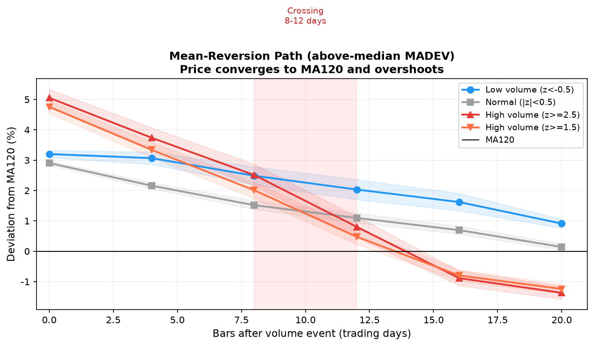
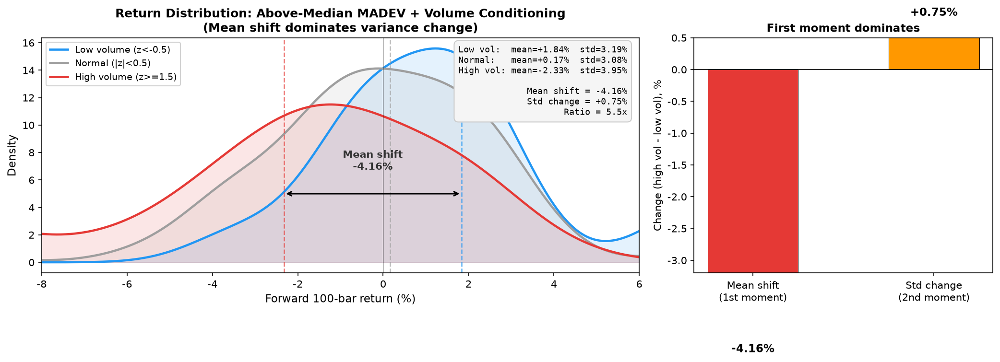
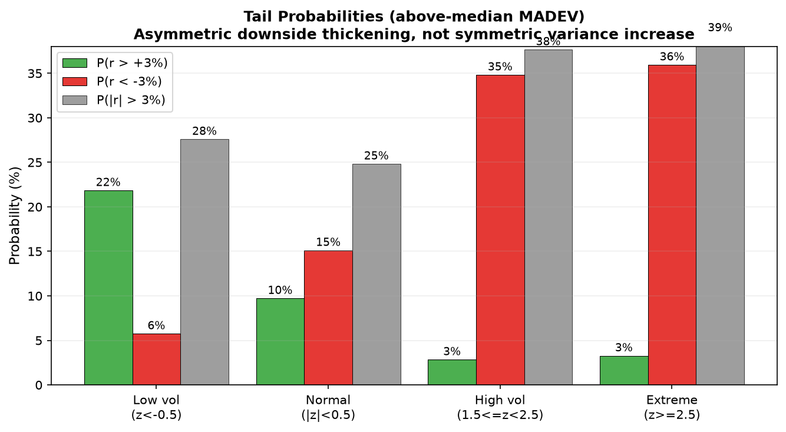

# 成交量对因子预测力的调节作用

> 日期：2026-08-05（r2 修订）
> 周期：1h，H=100（~20 个交易日）
> 数据：26 个期货合约，1586 个高 s_pre 事件（s_pre≥0.10）
> 配套：[volume-spike-trend-exhaustion-1h-daily-findings.md](volume-spike-trend-exhaustion-1h-daily-findings.md)、[r2-results.md](raw-workbench/r2/r2-results.md)
> 脚本：`r2_mean_reversion.py`、`r2_lopo_dual_filter.py`、`momentum_factor_test.py` 等

---

## 0. 核心命题

**成交量调节的核心是一个维度——价格相对均线的偏离（MADEV）在缩量时趋势延续、在放量时均值回归。回归是双向镜像：价格远高于均线时放量向下回归，价格远低于均线时放量向上回归。其他 29 个因子因为与 MADEV 相关而呈现翻转，它们本身没有独立信息。**

- 缩量时：MADEV 大（价格远离均线）→ 趋势延续，IC≈+0.17；
- 正常成交量时：MADEV 无预测力，IC≈0；
- 放量时：MADEV 大 → 往均线回归，高 s_pre 层 IC≈−0.4，低 s_pre 层 IC≈−0.6（镜像）。

全样本（不按成交量切分）的因子 IC 是缩量趋势延续和放量均值回归互相抵消后的净值，因此看起来弱。按成交量水平切分后，两端的预测力都增强。

### 从"30 个因子翻转"到"一个维度"

r2 的正交化检验（PCA + 多元交互回归，详见 [r2-results.md](raw-workbench/r2/r2-results.md) §7.2）表明：

- 30 个因子高度相关（MRET100↔MADEV120=0.96、MRET50↔MADEV120=0.94、RVOL20↔RANGE20=0.86）；
- PCA 前 4 个主成分解释 71% 方差，PC1（价格位置/趋势）单独占 41%；
- 多元交互回归中，控制所有因子后没有一个因子的 ×z 交互单独显著——所有交互被 PC1 吸收；
- **控制 MADEV120 后，VWAP_DEV20 残差 IC=+0.07（无增量），MRET/S_PRE/RVOL/PATEFF 全部不显著**；
- 因此 MADEV120 是充分统计量，"25/30 因子翻转"是同一个效应在不同代理变量上的投影，不是 25 个独立现象。

本文保留全因子表作为描述性证据，但解读应聚焦于 MADEV 这一个维度。

---

## 1. 成交量分组定义

使用同时段（hour-of-day）z-score，N=20：

$$Z_t = \frac{V_t - \mu^{(h)}_{t-N:t-1}}{\varsigma^{(h)}_{t-N:t-1}}$$

| 组 | z 范围 | 含义 | 高 s_pre 层样本量 |
|---|---|---|---:|
| very_low | z < −0.5 | 缩量（低于正常半个标准差以上） | 234 |
| base | \|z\| < 0.5 | 正常成交量 | 519 |
| mid | 0.5 ≤ \|z\| < 1.5 | 中间地带 | 345 |
| spike | 1.5 ≤ z < 2.5 | 放量 | 230 |
| extreme | z ≥ 2.5 | 极端放量 | 119 |

所有分析在**高 s_pre 层**（s_pre = mean/std over prior 100 bars ≥ 0.10）内进行，即已上涨的强趋势中。中/低 s_pre 层见 §6。

---

## 2. 全样本 IC 为何弱：高低成交量抵消

以 MRET50（过去 50 根涨幅）为例：

| 组 | IC | 方向 |
|---|---:|---|
| 全样本 | −0.160 | 看似反转 |
| very_low（缩量） | **+0.192** | 动量：涨得多继续涨 |
| base（正常） | +0.035 | 几乎无预测力 |
| mid | −0.208 | 开始反转 |
| spike（放量） | **−0.449** | 强反转：涨得多反而跌 |
| extreme（极放量） | **−0.436** | 强反转 |

$$|IC_{\text{base}}| + |IC_{\text{spike}}| = 0.48 \gg |IC_{\text{all}}| = 0.16$$

全样本 IC 是缩量动量（+0.19）和放量反转（−0.45）加权平均后的净值。如果不切成交量，会得出"MRET50 是弱反转因子"的错误结论；实际上它在不同成交量环境下是两个不同的因子。

---

## 3. 成交量五分位：连续渐变而非二值翻转

按 z 分五分位（Q1 最低量，Q5 最高量），IC 随成交量单调变化：

| 因子 | Q1(低) | Q2 | Q3 | Q4 | Q5(高) |
|---|---:|---:|---:|---:|---:|
| MRET20 | +0.156 | +0.151 | +0.026 | −0.207 | −0.293 |
| MRET50 | +0.197 | −0.001 | −0.041 | −0.411 | −0.388 |
| MRET100 | +0.196 | +0.027 | −0.057 | −0.311 | −0.389 |
| MRET200 | +0.155 | −0.051 | −0.196 | −0.340 | −0.448 |
| MADEV20 | +0.120 | +0.204 | +0.020 | −0.082 | −0.231 |
| MADEV60 | +0.221 | +0.066 | −0.034 | −0.386 | −0.363 |
| MADEV120 | +0.189 | +0.036 | −0.023 | −0.380 | −0.389 |
| RVOL20 | +0.222 | +0.088 | −0.037 | −0.211 | −0.340 |
| VWAP_DEV20 | +0.094 | +0.203 | −0.014 | −0.078 | −0.238 |
| REV20 | −0.156 | −0.151 | −0.026 | +0.207 | +0.293 |

### 三个特征

1. **单调性**：IC 从 Q1 到 Q5 基本单调递减，符号在 Q2–Q3 之间过零；
2. **非线性**：Q1→Q3 变化平缓（+0.2→0），Q3→Q5 剧烈跳变（0→−0.4）。不是线性关系，所以连续交互回归 $r \sim f + z + f\times z$ 多数不显著（只有 MRET200 显著），需要分位分组；
3. **两端预测力最强**：Q1（缩量）和 Q5（放量）的 \|IC\| 远大于 Q2/Q3/Q4。预测力呈 U 型，正常成交量反而是信息最少的区域。

---

## 4. 全因子分类

### 4.1 高 s_pre 层 spike vs base 的 IC 对比（H=100）

| 类别 | 因子 | IC(base) | IC(spike) | ΔIC | 行为 |
|---|---|---:|---:|---:|---|
| **动量** | MRET20 | +0.120 | −0.283 | −0.405 | 翻转 |
| | MRET50 | +0.035 | −0.441 | −0.476 | 翻转 |
| | MRET100 | +0.028 | −0.423 | −0.451 | 翻转 |
| | MRET200 | −0.078 | −0.457 | −0.379 | 负向增强 |
| | S_PRE (ν/σ) | −0.013 | −0.289 | −0.276 | 负向增强 |
| | MADEV20 | +0.129 | −0.195 | −0.324 | 翻转 |
| | MADEV60 | +0.073 | −0.413 | −0.486 | 翻转 |
| | MADEV120 | +0.056 | −0.444 | −0.500 | 翻转 |
| | HH100/200 | +0.16/+0.20 | −0.06/−0.07 | −0.23/−0.26 | 翻转 |
| | STREAK20 | +0.070 | −0.204 | −0.274 | 翻转 |
| | PATEFF50/100 | +0.09/−0.01 | −0.20/−0.32 | −0.29/−0.30 | 翻转 |
| **反转** | REV5 | −0.068 | +0.079 | +0.147 | 反向增强 |
| | REV20 | −0.123 | +0.237 | +0.360 | 反向增强 |
| | RSI14/30 | +0.11/+0.14 | −0.07/−0.06 | −0.17/−0.21 | 翻转 |
| | BB60 | +0.106 | −0.047 | −0.153 | 翻转 |
| **量价** | VWAP_DEV20 | +0.105 | −0.171 | −0.276 | 翻转 |
| | OBV_SLOPE20 | +0.158 | −0.100 | −0.258 | 翻转 |
| | VP_CORR20 | +0.179 | −0.046 | −0.225 | 翻转 |
| | ADL_SLOPE20 | +0.092 | −0.045 | −0.137 | 翻转 |
| **波动率** | RVOL20/60 | +0.06/+0.04 | −0.34/−0.38 | −0.40/−0.42 | 翻转 |
| | PARK20 | +0.014 | −0.434 | −0.448 | 翻转 |
| | RANGE1/20 | +0.02/−0.01 | −0.31/−0.44 | −0.33/−0.43 | 翻转 |
| | ATR14/60 | −0.14/−0.16 | +0.18/+0.18 | +0.32/+0.34 | 反向翻转 |
| **流动性** | AMIHUD5/20 | +0.11/+0.10 | −0.17/−0.17 | −0.27 | 翻转 |
| | KYLE20 | +0.141 | −0.112 | −0.253 | 翻转 |
| | SPREAD20 | −0.090 | +0.131 | +0.221 | 反向翻转 |
| **成交水平** | VRATIO20/60 | ≈0 | ≈0 | ≈0 | 无（与 z 共线） |
| | VPCT20/60 | ≈0 | ≈0 | ≈0 | 无（共线） |
| **K 线形态** | UPPER/LOWER_WICK | 弱 | ≈0 | <0.10 | 无（1h 无信息） |
| | BODY_RATIO | +0.075 | +0.007 | −0.068 | 无 |

### 4.2 总结

| 行为 | 因子数 | 典型代表 |
|---|---:|---|
| 翻转（正→负） | 18 | MADEV120、MRET50、PARK20、VWAP_DEV、OBV、RVOL |
| 负向增强（负更负） | 3 | MRET200、S_PRE、PATEFF100 |
| 反向翻转（负→正） | 4 | REV5/20、ATR14/60、SPREAD |
| 无变化 | 5 | VRATIO、VPCT、影线、BODY、SKEW |

约 **30 个因子中 25 个的预测力被成交量显著调节**，只有成交量水平本身（与条件变量共线）和 1h K 线形态不受影响。

### 4.3 正交化：25 个翻转本质是一个维度

r2 PCA 与多元回归（[r2-results.md](raw-workbench/r2/r2-results.md) §7.2）显示这 25 个翻转不是 25 个独立现象：

- 前 4 个主成分解释 71% 方差，PC1（价格位置/趋势，载荷集中在 MADEV60/120、MRET20/100、RVOL60）占 41%；
- 控制所有因子后，无单个 f×z 交互显著（β3 CI 全部含 0）；
- 控制 MADEV120 后其他因子无增量：

| 因子 | 残差×z β | CI | 显著？ |
|---|---:|---|---|
| MRET20 | −0.0016 | [−.003,+.001] | 否 |
| MRET50 | −0.0001 | [−.009,+.008] | 否 |
| MRET100 | −0.0038 | [−.012,+.001] | 否 |
| S_PRE | −0.0015 | [−.003,+.001] | 否 |
| **VWAP_DEV20** | **−0.0026** | [−.004,−.001] | 是* |
| RVOL20 | +0.0018 | [−.001,+.004] | 否 |
| PATEFF100 | +0.0002 | [−.002,+.003] | 否 |

\* VWAP_DEV20 在 1447 事件的子集上曾显著，但在完整 1586 事件数据集上残差 IC=+0.067（与 baseline 无差异），假阳性已修正。

**结论：MADEV120 是充分统计量。** 实践中只需 MADEV120 一个因子，不需要 30 个因子或双因子模型。

---

## 5. 机制解释

### 5.1 机制：均线偏离的均值回归（r2 修正）

r2 因果分离检验（[r2-deep-analysis-mean-reversion.md](raw-workbench/r2/r2-deep-analysis-mean-reversion.md) §1）表明，放量后的反转**不是"趋势强度耗尽"，而是"价格偏离长期均线后的均值回归"**：

- spike 内 MADEV120 与未来收益 IC=−0.61，控制 s_pre 后增强到 −0.71；
- s_pre（市场强度 ν/σ）原始 IC 只有 −0.14，控制 MADEV 后**翻正为 +0.24**——趋势越平滑未来反而越好，不存在"强趋势耗尽"；
- MADEV120 与 pre_cum 相关 0.96，是同一个维度（价格涨了多少/离均线多远）；
- 双排序确认：MADEV 高时无论 s_pre 高低都反转（−3.9%~−8.5%），s_pre 高但 MADEV 中反而为正（+0.46%）。

s_pre 的作用是**样本选择**（只在高 s_pre 趋势中研究回归），不是预测变量。预测回归幅度的是价格偏离均线的程度。

### 5.2 放量加速回归（一阶矩主导，二阶矩伴随放大）

高成交量不是反转的原因，而是**放大器**——让均线回归更快更剧烈（以下数字均为 MADEV 中位数以上子集，n_vlow=87, n_spike=247, n_extreme=153）：
- 缩量时高 MADEV 后偏离缓慢自然衰减（+4.8%→−1.2%，不穿越均线）；
- 放量时高 MADEV 后偏离在 60–80 根 bar（12–16 天）内从 +4.8% 降到 −0.8%，穿过均线并轻微过度穿越；
- 回归路径分三阶段：快速收敛（0–40 bar）、穿越（60–80 bar）、过度穿越稳定（80–100 bar，约 −1.2%）。



放量红线在 12–16 天穿过 0 轴（均线），缩量蓝线缓慢衰减但不穿越。阴影为标准误。

r2 不确定性检验（`r2_uncertainty_test.py`）进一步区分了一阶矩和二阶矩效应：

| MADEV 中位数以上 | z<−0.5（缩量） | z≥1.5（放量） | Δ |
|---|---:|---:|---:|
| mean r100 | +1.84% | **−2.33%** | **−4.16%**（一阶矩） |
| std r100 | 3.19% | 3.95% | +0.76%（二阶矩） |
| P(r>+3%) | 21.8% | 2.8% | −19.0pp |
| P(r<−3%) | 5.7% | 34.8% | +29.1pp |

- **一阶矩主导**：mean shift（−4.16%）是 std change（+0.76%）的 5.5 倍；
- 放量本身（控制 MADEV 后）不独立预测 \|r\|（β_z=−0.0009, CI 含 0）——不确定性放大只发生在"价格已经远离均线"的条件下；
- 这修正了 r1 早期"放量=不确定性增加/走向发散"的假说：放量的主效应是**方向性均值回归**，分布变宽是次要伴随效应；
- 这与"获利盘分配/新手接盘"的行为解释一致：高 MADEV 时放量代表大量反向交易进入，既推动价格回归（均值漂移），也让回归过程更剧烈（方差增大）。

下图直观对比一阶矩（均值漂移）和二阶矩（方差放大）：



左图展示 MADEV 中位数以上子集下缩量（蓝）、正常（灰）、放量（红）的未来 100 bar 收益分布。放量后分布整体左移（mean 从 +1.84% 降到 −2.33%），而分布宽度只略有增加；右图量化两者的量级差异——均值漂移（−4.16%）是标准差变化（+0.76%）的 5.5 倍。

尾部概率进一步说明这是**定向下移而非对称变宽**（同一 MADEV 中位数以上子集）：



放量把下行尾部（r<−3%）概率从缩量时的 5.7% 推高到 34.8%，而上行尾部（r>+3%）从 21.8% 压缩到 2.8%。分布不是对称变宽，而是左下尾增厚、右上尾消退。

### 5.3 均线周期越长信号越强

| MA 周期 | 极端放量 IC | 缩量 IC |
|---:|---:|---:|
| 20 | −0.25 | +0.04 |
| 60 | −0.52 | +0.17 |
| 120 | −0.63 | +0.20 |
| **200** | −0.63 | **+0.51** |

长期均线是更好的"价值中枢"。MADEV200 在缩量端远优于 MADEV120（IC +0.51 vs +0.20）。

### 5.4 为什么是 U 型而非线性

- Q1→Q3（缩量到正常）：随着成交量从"无分歧"过渡到"中性"，信息含量逐渐降低，但方向不变；
- Q3→Q5（正常到放量）：一旦成交量超过"正常水平"，就开始标记分配/耗尽，且越极端越确定，IC 加速变负；
- 这对应两种不同的市场状态（低量延续 vs 高量反转），中间地带是无信息的过渡区，不是一个连续谱。

### 5.5 为什么连续交互回归不显著

线性模型 $r = \beta_1 f + \beta_2 z + \beta_3 f\cdot z$ 假设 IC 随 z 线性变化，但实际 IC-z 关系是：
- 低 z 端平（IC≈+0.2 不变）；
- 中段快速过零；
- 高 z 端平（IC≈−0.4 不变）；
这是一个 S 型/阶跃型关系，线性 β3 会被两端的平台区拉低。分位分组或二值 spike dummy 更适合捕捉这种非线性。

---

## 6. 低 s_pre（下跌趋势）层：均线回归的镜像（r2 修正）

在 s_pre ≤ −0.10 的下跌趋势中，r2 用同 regime baseline 重新检验后，低 s_pre 层与高 s_pre 层**镜像对称**：放量本身不带来显著超额反弹，但叠加 MADEV（价格远离均线）后效应极强。

### 6.1 早期因子 IC 表（r1，仅作参考）

早期在不同 baseline 下得到的因子 IC（n_spike≈188, n_base≈397）：

| 因子 | IC(base) | IC(spike) | ΔIC | r1 方向解读 |
|---|---:|---:|---:|---|
| MRET20 | −0.004 | −0.221 | −0.214 | 继续跌 |
| MRET50 | +0.067 | −0.529 | −0.596 | 跌多+放量续跌 |
| MRET100/200 | −0.07/+0.35 | −0.59/−0.52 | −0.52/−0.87 | 同上 |
| REV20 | +0.038 | +0.223 | +0.185 | 反弹增强 |
| LOWER_WICK | −0.018 | +0.155 | +0.173 | 下影线+放量=反弹 |
| PATEFF50/100 | −0.06/−0.12 | +0.36/+0.43 | +0.42/+0.54 | r1 曾解读为"平滑下跌续跌" |
| RVOL20/60 | +0.07/+0.26 | +0.31/+0.51 | +0.24/+0.24 | 高波动+放量=反弹 |
| AMIHUD5/20 | +0.05/+0.07 | +0.42/+0.41 | +0.37/+0.34 | 流动性差+放量=反弹 |
| VOL_AR1 | −0.020 | +0.417 | +0.437 | 成交聚集+放量=反弹 |

这些 IC 混合了"跌深"和"跌浅"，方向看似矛盾，直到用 MADEV 分层才统一。

### 6.2 r2 修正：放量本身没有超额反弹

同 regime baseline（低 s_pre + \|z\|<0.5）下：

| 组 | n | mean r100 | %pos | Δ vs base |
|---|---:|---:|---:|---:|
| base（正常量） | 323 | +1.09% | 66% | — |
| spike（z≥1.5） | 62 | +1.50% | 69% | +0.42%（CI 含 0） |
| extreme（z≥2.5） | 73 | +1.60% | 71% | +0.52%（CI 含 0） |

三组都有正漂移（样本期商品整体偏多），但**放量没有显著超额反弹**。r1 撤回"熊市反弹"结论是正确的——只看 s_pre + z 而不看 MADEV，效应被混合掉了。

### 6.3 关键发现：MADEV 低时反弹极强（与高 s_pre 镜像）

在低 s_pre + 放量内按 MADEV120 三分位：

| 组 | MADEV 低（远低于均线） | MADEV 中 | MADEV 高 | IC(MADEV→r100) |
|---|---:|---:|---:|---:|
| spike | **+3.36%（90%）** | +0.46% | +0.63% | −0.50 |
| **extreme** | **+4.17%（96%）** | +0.35% | +0.33% | **−0.64** |
| base | +1.13% | +1.02% | +1.11% | −0.01 |

- **低 s_pre + 极端放量 + 价格远低于均线：96% 概率反弹，mean +4.17%**；
- baseline 中 MADEV 无预测力（IC=−0.01），说明是**放量触发了向均线的回归**；
- 这与高 s_pre 层完全镜像：高 s_pre + 极端放量 + 价格远高于均线 → 69% 下跌，mean −2.66%。

完整镜像：

| | MADEV 低（价格远低于均线） | MADEV 高（价格远高于均线） |
|---|---|---|
| **低 s_pre + 极端放量** | **+4.17%, 96% 涨** | +0.33%, 46% 涨（无效应） |
| **高 s_pre + 极端放量** | —（样本不足） | **−2.66%, 31% 涨** |

### 6.4 PATEFF 方向修正

r1 报告"平滑下跌+放量续跌"（PATEFF 高 IC 正向解读为续跌）。r2 用同 regime baseline 重新检验后**方向相反**：

| 组 | PATEFF 低（震荡下跌） | PATEFF 高（平滑下跌） |
|---|---:|---:|
| spike | +0.91%（68%） | **+2.09%（71%）** |
| extreme | +0.73%（62%） | **+2.50%（81%）** |
| base | +1.45%（65%） | +0.72%（68%） |

在低 s_pre + 放量中，**高 PATEFF（平滑单边下跌）反弹更强**（+2.50%, 81%），而非续跌。这与 CGW 框架一致：平滑下跌后的放量更可能是流动性抛售出清，反弹更强；r1 的"续跌"解读来自 baseline 选择偏差。PATEFF 在低 s_pre 中不是例外，而是均线回归的放大器。

### 6.5 反弹路径

极端放量组的 MADEV 回归路径：

| H | mean rH | MADEV_post | %pos |
|---:|---:|---:|---:|
| 20 | −0.31% | −2.75% | 44% |
| 40 | −0.01% | −1.64% | 47% |
| 60 | +0.38% | −0.63% | 55% |
| 80 | +0.84% | +0.25% | 60% |
| 100 | **+1.60%** | **+1.16%** | 71% |

价格先续跌到 H=40（8 天）触底，60–80 bar 穿过均线，100 bar 时回到均线上方 +1.16%。与高 s_pre 层的 12–16 天穿越对称。

### 6.6 修正后的结论

- 低 s_pre 层不是"熊市反弹未证实"，而是**与高 s_pre 镜像的均线回归**；
- 单独的 s_pre 或 z 不够，必须叠加 MADEV；
- 之前"PATEFF 例外"是 baseline 偏差，修正后 PATEFF 高（平滑下跌）+ 放量反弹更强；
- 局限：低 s_pre + extreme + MADEV 低只有 24 个事件，需更长数据确认。

---

## 7. 中 s（震荡）层：成交量几乎无调节作用

s_pre 在 [−0.10, +0.10] 之间（n_spike=1100, n_base=2460），只有 3/30 个因子边际显著：

| 因子 | ΔIC | p |
|---|---:|---|
| MRET20 | +0.084 | <0.05 |
| PATEFF50 | −0.107 | <0.01 |
| VP_CORR20 | +0.088 | <0.01 |
| AMIHUD20/5 | −0.08 | <0.05 |

效应量级只有高 s_pre 层的 1/4–1/3。**成交量调节作用只在已有强趋势时才成立**，震荡市中放量不改变因子方向。这与 [findings §2.2](volume-spike-trend-exhaustion-1h-daily-findings.md) 一致：震荡市 spike 只跑输 0.58%，无显著方向。

---

## 8. 对因子使用的实践含义

### 8.1 不要用全样本 IC 判断因子

全样本 IC 混合了缩量趋势延续和放量均值回归，会低估甚至误判因子。必须在成交量分层内评估因子。

### 8.2 因子方向应随成交量切换（但只需看 MADEV）

因为 30 个因子的翻转本质上是 MADEV 一个维度，实践中只需监控一个条件：

| 成交量环境（高 s_pre 趋势中） | MADEV120 高时的预期 | 操作含义 |
|---|---|---|
| 缩量（z<−0.5） | 趋势延续，IC≈+0.17，mean +0.99% | 持有/加仓多头 |
| 正常（\|z\|<0.5） | 无方向，IC≈0 | 不操作 |
| 放量（1.5≤z<2.5） | 弱均值回归，IC≈−0.19，mean −0.95% | 开始减仓 |
| **极端放量（z≥2.5）** | **强均值回归，IC≈−0.41，mean −1.57%** | **明确减仓/止盈** |

r2 直接验证了"回归到均线"：极端放量时当前 MADEV=+3.22%，H=100 后偏离变 −0.75%（价格穿过均线），收敛幅度 3.97%；缩量时 H 后偏离仍为 +0.49%（趋势保持）。

### 8.3 市场状态过滤

放量均值回归依赖整体市场状态（[r2-results.md](raw-workbench/r2/r2-results.md) §7.3）：

| 市场整体状态 | 放量 mean r100 | IC(MADEV) | 缩量 mean r100 | IC(MADEV) |
|---|---:|---:|---:|---:|
| 弱 | −0.27% | −0.25 | +0.45% | −0.35（反向） |
| 中 | **−2.23%** | **−0.67** | +1.18% | +0.06 |
| 强 | −1.91% | −0.41 | +1.13% | **+0.57** |

- 放量端：排除弱市场后量级从 −1.4% 提升到 −2.1%；
- 缩量端：在强市场中 IC=+0.57 最干净，弱市场中反而为负。

### 8.4 规格与 OOS 现实

```
放量均值回归（辅助减仓信号）：
  高 s_pre (s_pre≥0.10) AND 市场整体非弱
  AND z≥2.5（极端放量，比 z≥1.5 更可靠）
  AND MADEV120 高
  → H=100 mean −1.6%~−2.1%，66–67% 为负
  → OOS 注意年度衰减：2025 IC=−0.50，2026 仅 −0.16
```

```
缩量趋势延续（持仓信号）：
  高 s_pre AND 市场整体中/强
  AND z<−0.5（缩量）
  → H=100 mean +1.0%~+1.2%，约 60% 上涨
  → 全样本 IC=+0.17，LOPO 10/11 通过（i 铁矿例外）
  → 时间 OOS 上增强（+0.17→+0.53），但单品种方向一致性较差
```

### 8.5 诚实边界

- 缩量端效应量级（IC +0.17）小于放量端（极端放量 IC −0.41），且逐品种没有一个同时满足"缩量正+放量负"，是跨品种聚合现象；
- 放量端 2026 年明显衰减，不能假设恒定；
- 以上都是 1h 商品期货 2024–2026 的结果，未在股票/加密/利率上验证。

---

## 9. 局限

1. **只在高 s_pre 层样本充足**：高 s_pre n=1586，但放量 spike+极端共 804，缩量仅 217；低 s_pre spike 仅 188；
2. **1h K 线**：K 线形态因子无效可能是粒度问题，5m/tick 可能不同；5m 上效应弱（ΔIC≈−0.05~−0.09），1h 是最佳粒度；
3. **OOS 与年度衰减**：MADEV120 条件 IS −4.6%、时间 OOS −1.8%；2025 年极端放量 IC=−0.50，2026 年衰减到 −0.16，放量均值回归不是恒定效应；
4. **品种一致性有限**：逐品种没有一个同时满足"缩量 IC 正 + 放量 IC 负"；LOPO 10/11 是跨品种聚合结果（i 铁矿例外），不等于每个品种内部都成立；
5. **无 OI/订单流**：放量增仓 vs 放量减仓可能完全不同，H2 因数据缺失未验证；
6. **期货品种少**（12 个 prefix），截面 IC 不稳定，主要用时序/分组；
7. **成交量 z 与 VRATIO/VPCT 共线**：这两个因子在 spike 内无区分度是数学必然，不代表它们无效；
8. **30 因子翻转是一个维度的投影**：MADEV120 是充分统计量，其他因子无独立增量（§4.3），不应把"25/30 显著"解读为多个独立 alpha。

---

## 10. 与公开文献的关系

本文的核心发现——"高成交量伴随价格反转、低成交量伴随趋势延续"——在学术文献中有直接前身和理论基础。

### 10.1 Campbell, Grossman & Wang (1993)

**Campbell, J. Y., Grossman, S. J., & Wang, J. (1993). "Trading Volume and Serial Correlation in Stock Returns." *Quarterly Journal of Economics* 108(4), 905–939.**

这是本研究最直接的学术前身。CGW 的核心命题：

> *"Price changes accompanied by high volume will tend to be reversed. This will be less true of price changes on days with low volume."*

CGW 的理论模型：风险厌恶的做市商面对非信息交易者（流动性交易者）的抛压时提供流动性。高成交量日的价格变动更可能由流动性冲击驱动（因此会被反转），低成交量日的价格变动更可能反映基本面信息（因此不反转）。成交量本身没有信息含量，它的"识别功能"（identification function）是揭示价格变动的来源。

对应关系：

| CGW 1993 | 本文发现 |
|---|---|
| 高成交量 → 收益反转 | 放量时 MADEV IC=−0.4，价格回归均线 |
| 低成交量 → 收益正自相关 | 缩量时 MADEV IC=+0.17，趋势延续 |
| 成交量是"识别变量"而非独立信号 | Z 单独 R²=0.054，是触发器/调节器而非主预测器 |
| 成交量本身无信息含量 | Skew 单独 R²≈0，简单成交量水平与 z 共线 |

Chincarini & Llorente (1999) 直接验证了 CGW：*"High-transaction securities experience price reversals, while low transaction securities have positive autocorrelated returns."*

### 10.2 非线性扩展：Morimoto & Shintani (2010)

Morimoto & Shintani 用门槛自回归（TAR/STAR）模型扩展 CGW，发现高成交量+负前期收益时反转最强。这与本文的发现对称：我们发现高成交量+高 MADEV（即前期涨幅大、价格远离均线）时均值回归最强。两者共同表明成交量的反转效应取决于前期价格方向/位置，不是无条件的。

### 10.3 均值回归与移动平均

- Brock, Lakonishok & LeBaron (1992) 发现移动平均规则有预测力；但 Urquhart, Gebka & Hudson (2015) 发现 1987 年后预测力衰减（适应性市场假说），与本文观察到的 2026 年放量端效应衰减一致；
- 均值回归半衰期研究显示商品为 60–120 天（日线），本文在 1h 上的 12–16 天穿越均线与此量级一致；
- 本文的增量：MADEV120（价格偏离均线）比 raw return 自相关更精确地捕捉了"偏离均衡价值"这一概念，是充分统计量。

### 10.4 Volume Profile

- Dalton, *Mind Over Markets* (2006)：Volume Profile 的机构实践标准，POC 作为"磁石"、HVN/LVN 作为支撑阻力；
- 学术界对 Volume Profile 形状（偏度）的正式研究较少，本文的 Skew 指标是对 CGW"成交量识别价格变动来源"的细化——Skew 进一步区分了"在哪个价位放量"（高位派发 vs 低位承接）；
- 期货实践文献确认：*"Mean reversion to session VWAP is statistically real during balanced regimes"*（Dhawal.org futures research summary）。

### 10.5 本文的增量

1. **市场**：CGW 及后续研究集中在股票市场，本文在中国商品期货 1h 上验证了同一机制；
2. **变量精确化**：用 MADEV（价格偏离均线）替代 raw return 自相关，并证明它是充分统计量（R²=0.118，占总解释力 77%）；
3. **Volume Profile Skew**：提出成交量分布偏度作为"好放量/坏放量"的区分器，负偏+放量=高位派发（87% 下跌），正偏+放量=低位承接（76% 上涨）；
4. **消融实验**：系统量化 MADEV（★★★★★）、Z（★★★☆）、Skew（★☆）三个变量的相对贡献，这在现有文献中未见；
5. **一阶矩 vs 二阶矩分离**：证明放量的主效应是方向性均值漂移（mean shift）而非不确定性增加（variance expansion），前者是后者的 5.5 倍。

### 10.6 文献启发的后续方向

- CGW 模型预测高量+跌后反弹（流动性买入压力），本文低 s_pre 层已确认镜像均线回归（§6.3，96% 上涨但仅 24 事件），值得在更长数据上验证；
- Llorente et al. (2002) 的信息交易 vs 对冲交易模型可解释品种间效应差异；
- 适应性市场假说提醒：放量反转效应可能随参与者学习而衰减，需持续监控（本文 2025 vs 2026 的差异已是证据）。

---

## 11. 与主文档的关系

- 本文是 [volume-spike-trend-exhaustion-1h-daily-findings.md](volume-spike-trend-exhaustion-1h-daily-findings.md) 的**一般化**：主文档聚焦"放量后发生什么"，本文回答"成交量如何系统性改变所有因子的预测方向"；
- 主文档的"放量→ν 翻转"是本文机制的微观基础；
- 本文的 U 型/非线性发现解释了为什么简单的 spike 二值条件有效但不是全部——缩量端同样有信息；
- 因子交互的详细数据表见 [`raw-workbench/factor-interaction/`](raw-workbench/factor-interaction/)：
  - `results-momentum-factor-interaction.md`
  - `results-reversal-volume-factors-and-conditions.md`
  - `results-vol-liqudity-and-oos.md`
