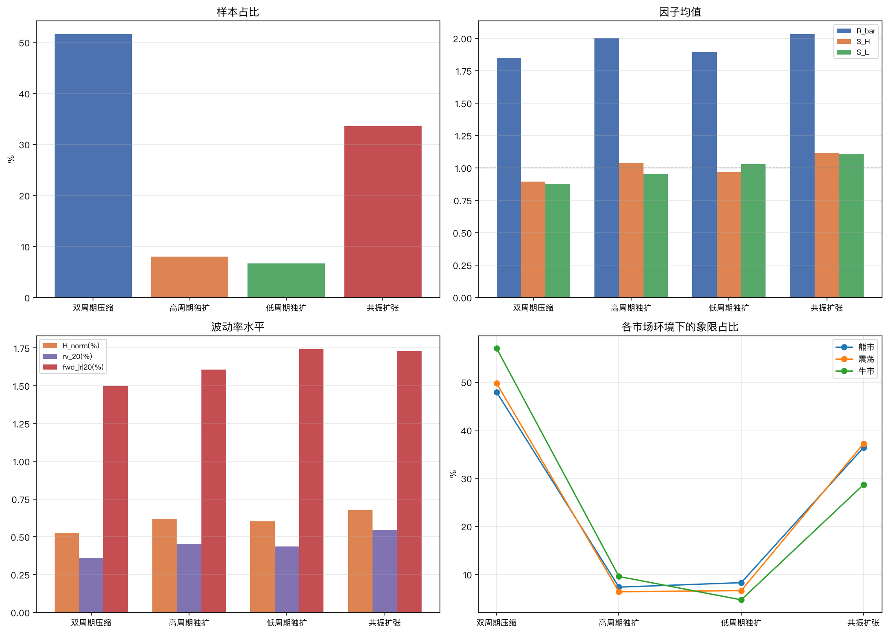
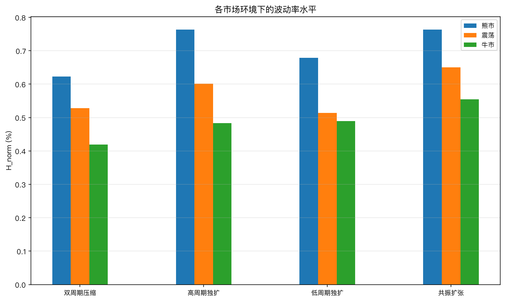
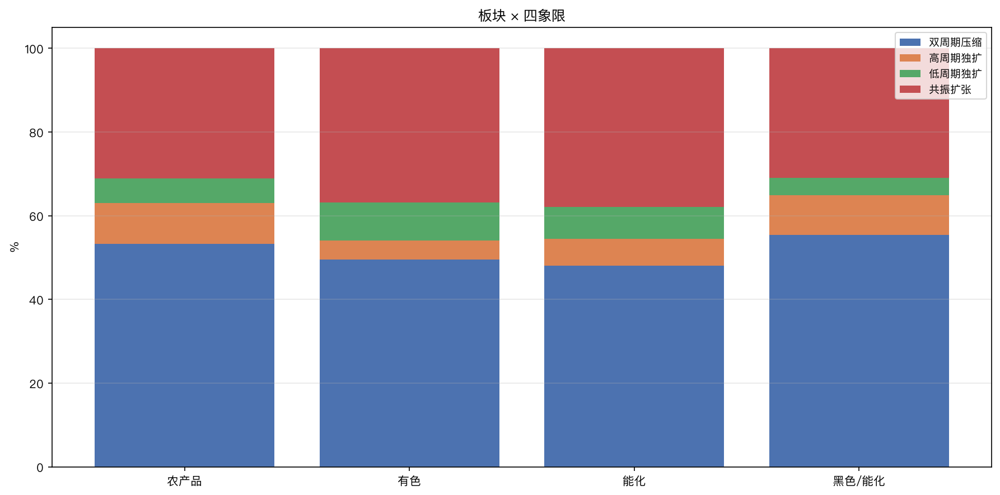
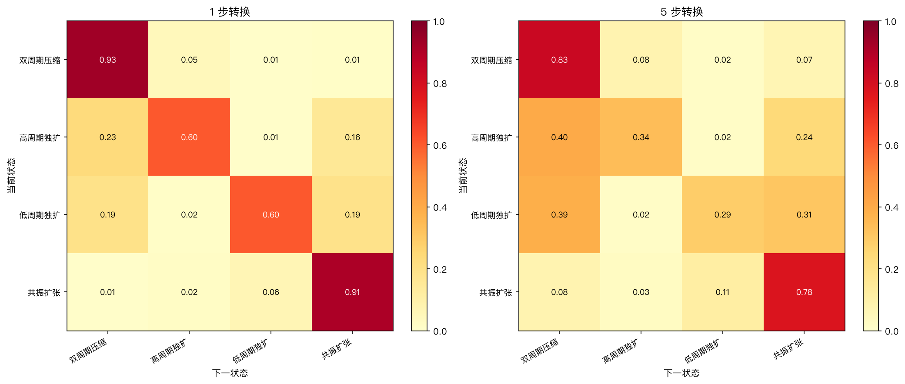
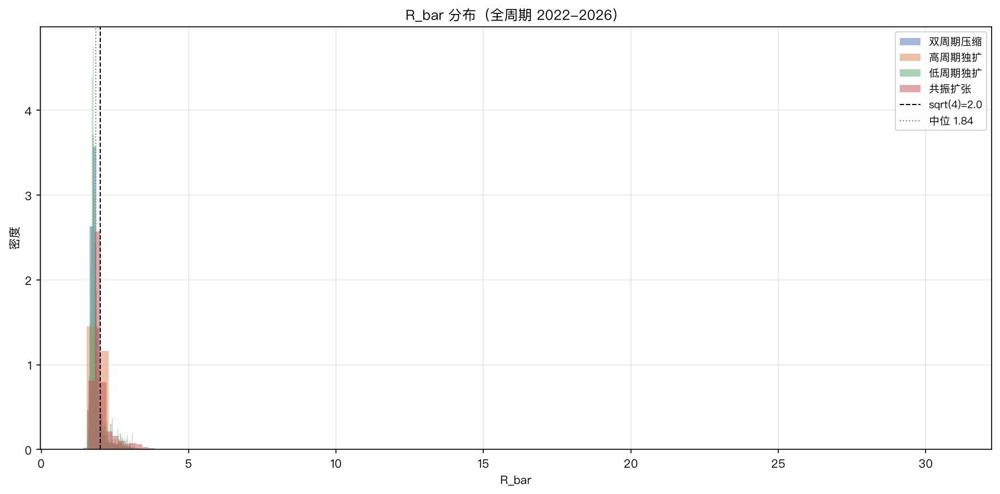
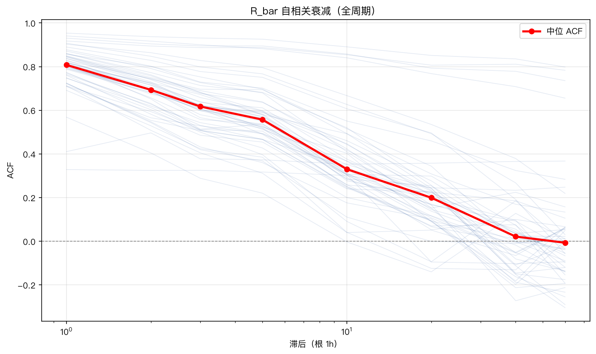

# 四象限市场环境画像

## 元信息

- 主题：ATR 跨周期比值 state_S 四象限的描述性统计
- 日期：2026-08-07
- 数据：52 个商品期货合约，2022-05 至 2026-04，共 33,996 个 1h 样本
- 覆盖市场环境：2022 熊市、2023 震荡、2024–2026 牛市
- 脚本：[profile_quadrants_full.py](./scripts/profile_quadrants_full.py)
- 输出：[outputs/profile_full/](./outputs/profile_full/)
- 图表：[outputs/profile_full/figures/](./outputs/profile_full/figures/)

## 1. 因子定义

基于 1h 和 15m ATR 的 Wilder 平滑值：

- `H = ATR_1h(14)`，`H_long = ATR_1h(50)`
- `L_clock = ATR_15m(56)`（56 根 15m ≈ 14 根 1h，相同时长对齐）
- `L_long = ATR_15m(200)`
- `R_bar = H / L_clock`：跨周期 ATR 比值
- `S_H = H / H_long`：1h 短长 ATR 比（>1 表示高周期扩张）
- `S_L = L_clock / L_long`：15m 短长 ATR 比（>1 表示低周期扩张）
- `H_norm = H / close`：归一化 1h 波动率
- `rv_20`：20 根 1h 收益率的已实现波动率

四象限分类：

| 状态 | S_H | S_L | 含义 |
|---|---|---|---|
| co_compress | <1 | <1 | 双周期压缩 |
| H_only | >1 | <1 | 高周期独扩 |
| L_only | <1 | >1 | 低周期独扩 |
| co_expand | >1 | >1 | 共振扩张 |

## 2. 整体画像

### 2.1 样本分布与因子均值

| 状态 | 占比 | R_bar 均值 | R_bar 中位 | S_H | S_L | H_norm(%) | rv_20(%) | fwd_\|r\|₂₀(%) |
|---|---:|---:|---:|---:|---:|---:|---:|---:|
| 双压缩 | 51.6% | 1.85 | 1.80 | 0.90 | 0.88 | 0.52 | 0.36 | 1.50 |
| H_only | 8.1% | 2.00 | 1.91 | 1.04 | 0.96 | 0.62 | 0.45 | 1.61 |
| L_only | 6.7% | 1.89 | 1.79 | 0.97 | 1.03 | 0.60 | 0.44 | **1.74** |
| 共振扩张 | 33.6% | **2.03** | **1.92** | **1.11** | **1.11** | **0.68** | **0.54** | 1.73 |

### 2.2 关键观察

1. **双压缩是常态**：51.6% 的时间两个周期都在收缩，市场大部分时间处于低波动状态；
2. **共振扩张波动最高**：H_norm 0.68%，比双压缩高 30%，rv_20 高 51%；
3. **L_only 的前向波动最高**（fwd_|r|₂₀ = 1.74%），略高于共振扩张（1.73%）——这是一个反直觉发现：低周期独扩虽然当下波动不是最高，但后续 20 根波动最大；
4. **H_only 和 co_expand 的 R_bar 接近**（2.00 vs 2.03），说明仅看 R_bar 无法区分"独扩"和"共振"，必须看 S_H/S_L 组合；
5. R_bar 中位数 1.82，仍低于理论值 sqrt(4)=2.0，波动聚集效应在全周期数据中稳定存在。

## 3. 牛熊市场环境对比

### 3.1 各市场环境下的象限占比

| 状态 | 熊市(2022) | 震荡(2023) | 牛市(2024-26) |
|---|---:|---:|---:|
| 双压缩 | 47.9% | 49.7% | **57.0%** |
| H_only | 7.4% | 6.4% | **9.6%** |
| L_only | **8.3%** | 6.6% | 4.7% |
| 共振扩张 | 36.4% | **37.2%** | 28.7% |

### 3.2 各市场环境下的波动率（H_norm %）

| 状态 | 熊市 | 震荡 | 牛市 | 熊/牛比 |
|---|---:|---:|---:|---:|
| 双压缩 | 0.62 | 0.53 | 0.42 | 1.48 |
| H_only | 0.76 | 0.60 | 0.48 | 1.58 |
| L_only | 0.68 | 0.51 | 0.49 | 1.39 |
| 共振扩张 | 0.76 | 0.65 | 0.56 | 1.36 |

### 3.3 前向波动率 fwd_|r|₂₀（%）

| 状态 | 熊市 | 震荡 | 牛市 |
|---|---:|---:|---:|
| 双压缩 | 1.83 | 1.50 | 1.13 |
| H_only | **2.09** | 1.40 | 1.19 |
| L_only | 2.07 | 1.38 | 1.20 |
| 共振扩张 | 2.00 | 1.66 | 1.31 |

### 3.4 牛熊差异的含义

1. **牛市更"安静"**：双压缩占比 57%（熊市 48%），整体波动率低 30–40%；
2. **熊市 L_only 翻倍**：8.3% vs 4.7%，低周期独扩是高波动环境的特征——短周期频繁出现独立波动脉冲；
3. **熊市 H_only 后波动最大**（fwd_|r|₂₀ = 2.09%），H_only 在熊市是更强的波动预警信号；
4. **震荡市共振扩张最多**（37.2%），方向不明但波动频繁；
5. 象限占比本身可以作为**市场环境温度计**：双压缩 >55% 偏牛市，共振扩张 >35% 偏熊市/震荡。

## 4. 板块差异

| 板块 | 双压缩 | H_only | L_only | 共振扩张 |
|---|---:|---:|---:|---:|
| 农产品 | 53.2% | **9.8%** | 5.9% | 31.1% |
| 有色 | 49.5% | 4.6% | **9.0%** | 36.9% |
| 能化 | 48.1% | 6.3% | 7.6% | **37.9%** |
| 黑色/能化 | 55.4% | 9.6% | 4.0% | 31.0% |

- **农产品 H_only 最多**（9.8%）：高周期独扩频繁，可能受季节性和政策影响；
- **有色 L_only 最多**（9.0%）：低周期独立波动多，国际定价导致短周期冲击频繁；
- **能化共振扩张最多**（37.9%）：全周期波动最活跃，受原油影响；
- **黑色/能化双压缩最多**（55.4%）且 L_only 最少（4.0%），波动结构相对简单。

## 5. 交易时段

| 时段 | 双压缩 | H_only | L_only | 共振扩张 |
|---|---:|---:|---:|---:|
| 日盘 | 52.8% | **8.5%** | 6.6% | 32.2% |
| 夜盘 | 48.7% | 7.8% | 6.8% | **36.7%** |
| 其他 | 54.8% | 6.9% | 7.0% | 31.2% |

- **日盘 H_only 略多**（8.5%）：高周期波动在日盘更容易启动；
- **夜盘共振扩张最多**（36.7%）：外盘联动导致双周期同时活跃；
- 时段差异不大，象限分类主要由市场状态而非时段驱动。

## 6. 状态持续时间

| 状态 | 段数 | 均值(根) | 中位 | p25 | p75 | p90 | max |
|---|---:|---:|---:|---:|---:|---:|---:|
| 双压缩 | 1,231 | 14.3 | **5** | 2 | 17 | 45 | 168 |
| H_only | 1,090 | 2.5 | 2 | 1 | 3 | 5 | 35 |
| L_only | 904 | 2.5 | 2 | 1 | 3 | 5 | 59 |
| 共振扩张 | 1,074 | 10.6 | 4 | 2 | 12 | 30 | 113 |

- **双压缩最持久**（中位 5 根，p90 达 45 根），可维持数天到数周；
- **H_only 和 L_only 都是短暂过渡态**（中位 2 根），通常几小时内结束；
- 共振扩张中位 4 根，比独扩态持久，比压缩态短；
- 这解释了为什么 H_only/L_only 难以交易——信号出现时状态可能已经结束。

## 7. 状态转换

### 7.1 1 步转换概率

| 从 \ 到 | 双压缩 | H_only | L_only | 共振扩张 |
|---|---:|---:|---:|---:|
| 双压缩 | **0.932** | 0.047 | 0.009 | 0.012 |
| H_only | 0.231 | **0.602** | 0.011 | 0.155 |
| L_only | 0.192 | 0.015 | **0.604** | 0.188 |
| 共振扩张 | 0.011 | 0.020 | 0.063 | **0.907** |

### 7.2 5 步转换概率

| 从 \ 到 | 双压缩 | H_only | L_only | 共振扩张 |
|---|---:|---:|---:|---:|
| 双压缩 | 0.783 | 0.077 | 0.033 | 0.107 |
| H_only | 0.398 | 0.273 | 0.038 | 0.291 |
| L_only | 0.331 | 0.053 | 0.243 | 0.373 |
| 共振扩张 | 0.075 | 0.049 | 0.097 | 0.778 |

### 7.3 转换规律

1. **双压缩和共振扩张有强持续性**（0.93/0.91），是两个"吸引子"状态；
2. 双压缩主要通过 H_only 离开（4.7%），很少直接转 L_only（0.9%）——波动通常从高周期启动；
3. H_only 后 15.5% 进入共振扩张（高周期带动低周期），23.1% 回到压缩；
4. L_only 后 18.8% 进入共振扩张（比例高于 H_only），但 L_only 样本少；
5. 共振扩张主要退回双压缩的路径是先经 L_only（6.3%），高周期先收缩；
6. 5 步后 H_only/L_only 约 40% 回到压缩，30–37% 进入共振扩张——独扩态是"分叉路口"。

## 8. R_bar 统计特征

### 8.1 分布

| 统计量 | 值 |
|---|---:|
| 均值 | 1.88 |
| 中位数 | 1.82 |
| 标准差 | 0.18 |
| p05 | 1.64 |
| p95 | 2.20 |
| 偏度 | 0.75 |

- R_bar 中位数 1.82，全周期稳定低于理论值 2.0；
- 分布右偏，极端高值（>2.2）比极端低值多；
- H_only 和 co_expand 的分布明显右移。

### 8.2 自相关与均值回归

| 滞后 | 中位 ACF |
|---:|---:|
| 1 | 0.81 |
| 5 | 0.56 |
| 20 | 0.20 |
| 半衰期 | **3.2 根 1h（约半天）** |

- R_bar 有强自相关，但半衰期仅半天；
- 极端 R_bar 值通常在几个交易日内回归中枢；
- 适合作为"波动制度温度计"（当前偏离中枢多远），不适合做趋势跟踪信号。

## 9. 波动率预测力

### 9.1 与前向波动率的相关性（全周期）

| 指标 | corr(\|r\|_5) | corr(\|r\|_20) |
|---|---:|---:|
| **H_norm** | **0.41** | **0.43** |
| rv_20 | 0.35 | 0.38 |
| S_L | 0.09 | 0.08 |
| S_H | 0.06 | 0.06 |
| R_bar | 0.02 | 0.05 |

### 9.2 分市场环境（h=20）

| 指标 | 熊市 | 震荡 | 牛市 |
|---|---:|---:|---:|
| H_norm | **0.40** | **0.37** | **0.35** |
| rv_20 | 0.34 | 0.30 | 0.33 |
| S_L | 0.04 | 0.06 | 0.08 |
| S_H | 0.02 | 0.06 | 0.10 |
| R_bar | -0.01 | -0.03 | **0.14** |

### 9.3 含义

1. **当前波动率水平是预测未来波动率的最佳指标**（H_norm corr 0.41），远优于任何跨周期比值；
2. **跨周期比值（R_bar/S_H/S_L）对波动率预测力弱**（全周期 corr 0.02–0.09）；
3. R_bar 在牛市中对波动有弱预测力（0.14），在熊市/震荡市中为负或零——不稳健；
4. 跨周期比值的价值不在于预测波动率大小，而在于刻画**波动结构**（谁主导、是否共振）。

## 10. 综合画像

### 10.1 四象限分别"是什么样的市场"

| 状态 | 市场特征 | 持续 | 后续波动 | 最常见于 |
|---|---|---|---|---|
| **双压缩** | 平静、低波动、方向酝酿 | 数天–数周 | 最低 | 牛市（57%） |
| **H_only** | 高周期信息驱动、短周期尚未跟随 | 几小时 | 中高 | 牛市日盘、农产品 |
| **L_only** | 短周期脉冲、噪声/流动性冲击 | 几小时 | **最高** | 熊市（8.3%）、有色 |
| **共振扩张** | 趋势启动/事件冲击、双周期确认 | 1–5 天 | 高 | 熊市/震荡、能化 |

### 10.2 跨周期比值的真正价值

经过 Stage 1–9 和熊市验证，跨周期 ATR 比值的价值不在于预测方向，而在于：

1. **市场状态分类**：四象限清晰区分了压缩/独扩/共振四种波动结构；
2. **环境温度计**：象限占比变化反映牛熊转换（双压缩 >55% 偏牛，共振 >35% 偏熊）；
3. **板块特征刻画**：农产品 H_only 多、有色 L_only 多、能化共振多，对应不同的微观结构；
4. **波动结构描述**：H_only vs L_only 标记了波动来源（高周期信息 vs 短周期脉冲），可用于风险管理；
5. **状态转换路径**：压缩→H_only→共振 vs 压缩→L_only→共振 的路径差异，描述了波动传导机制。

### 10.3 不适合的用途

- ❌ 方向预测（已被熊市数据否定，所有方向信号都是 beta）；
- ❌ 波动率幅度预测（H_norm 远优于 R_bar）；
- ❌ 短期交易信号（H_only/L_only 持续仅 2 根，入场即结束）；
- ❌ 市场中性策略（多空组合在熊市翻转）。

## 11. 后续研究方向

1. **L_only 在熊市中的特征**：占比翻倍、前向波动最高，研究其是否是危机/高波动预警信号；
2. **状态转换路径**：压缩→H_only→共振 vs 压缩→L_only→共振 在牛熊中的概率差异和后续波动差异；
3. **象限占比作为市场择时指标**：双压缩占比 >55% 时偏多配置，共振 >35% 时偏防守；
4. **结合 R_bar 和 H_norm**：R_bar 描述结构、H_norm 描述幅度，两者组合可能提升波动预测；
5. **板块轮动**：不同板块的象限特征差异是否能用于板块选择。

## 12. 文件索引

| 文件 | 内容 |
|---|---|
| [profile_quadrants_full.py](./scripts/profile_quadrants_full.py) | 全周期画像脚本 |
| [outputs/profile_full/](./outputs/profile_full/) | CSV 统计表 |
| [outputs/profile_full/figures/](./outputs/profile_full/figures/) | 7 张图表 |
| [profile_quadrants.py](./scripts/profile_quadrants.py) | 牛市样本画像（早期版本） |
| [compare_5m_15m.py](./scripts/compare_5m_15m.py) | 5m/15m 口径对比 |
| [term_structure.py](./scripts/term_structure.py) | F 组跨期限结构 |
| [term-bear-validation-archive.md](./term-bear-validation-archive.md) | R_1h_d 熊市验证归档 |
| [wrap-up-and-next-direction.md](./wrap-up-and-next-direction.md) | 阶段性总结与方向校准 |
