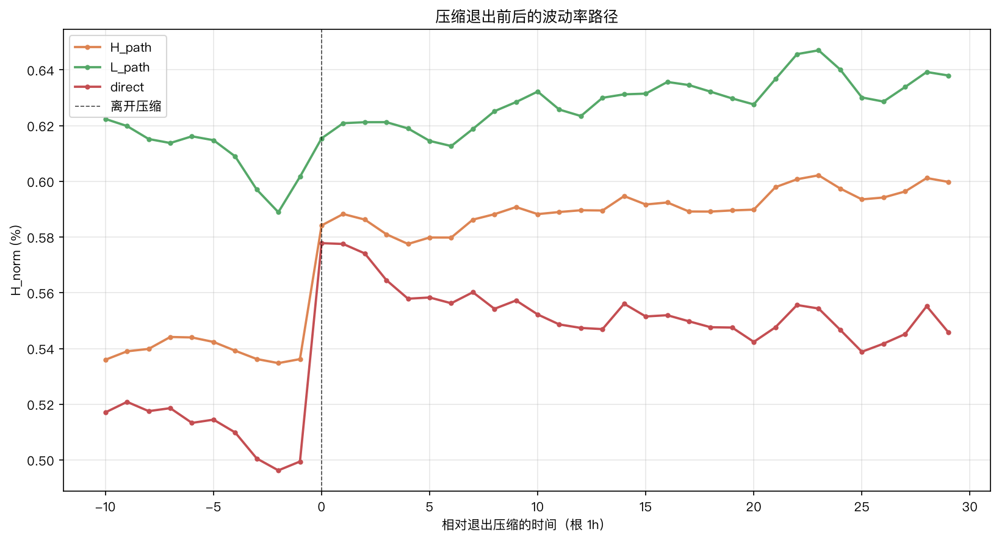
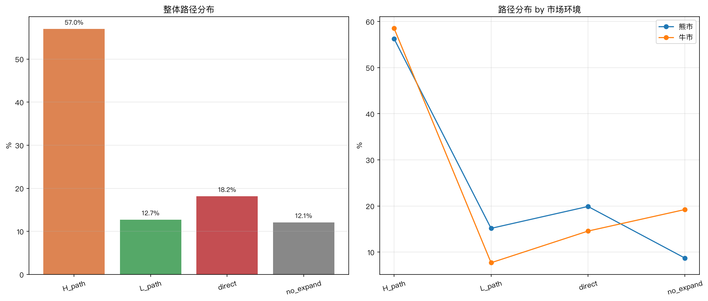
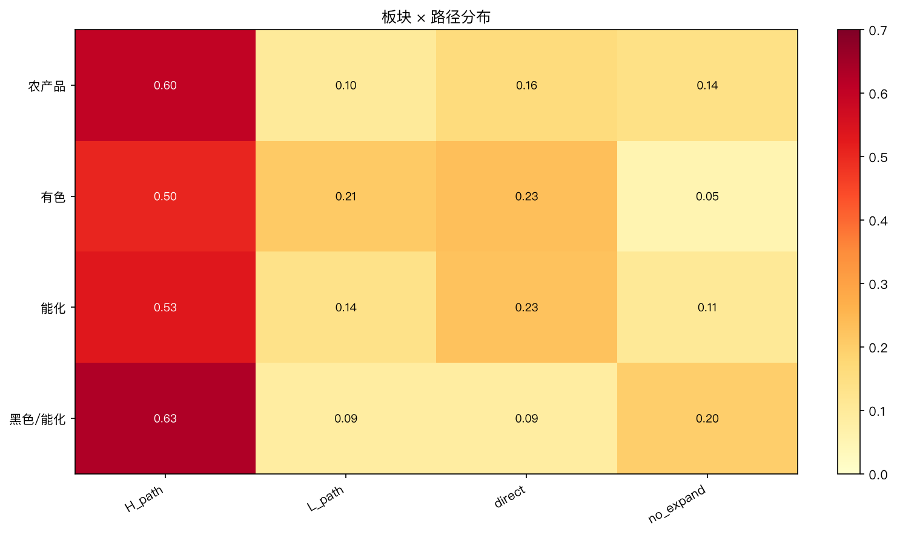
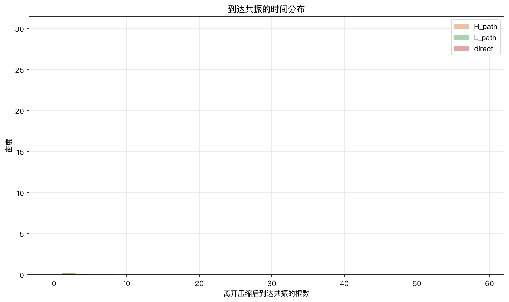

# 状态转换路径分析

## 元信息

- 主题：co_compress 退出后，经 H_only/L_only/direct 进入 co_expand 的路径差异
- 日期：2026-08-07
- 数据：52 个商品期货合约，2022-05 至 2026-04，共 33,996 个 1h 样本
- 脚本：[transition_paths.py](./scripts/transition_paths.py)
- 输出：[outputs/transition_paths/](./outputs/transition_paths/)
- 前置文档：[quadrant-profile.md](./quadrant-profile.md)

## 1. 研究问题

四象限画像显示状态转换有明显的方向偏好：压缩主要经 H_only 离开（4.7%），很少直接转 L_only（0.9%）。本研究追踪每段 co_compress 在 60 根（约 2 周）内的完整走向，对比两条路径：

- **H_path**：co_compress → H_only → co_expand（高周期先扩张）
- **L_path**：co_compress → L_only → co_expand（低周期先扩张）
- **direct**：co_compress → co_expand（直接共振，无独扩过渡）
- **no_expand**：60 根内未进入共振

关注：路径频率、时间结构、波动率变化、方向收益，以及在牛熊/板块中的差异。

## 2. 数据与方法

### 2.1 样本

- 与全周期画像相同：52 合约、33,996 行、2022–2026；
- 共识别出 **1,123 段 co_compress**；
- 其中 987 段（87.9%）在 60 根内到达 co_expand。

### 2.2 路径识别

对每段压缩，记录：
- 离开压缩后的第一个状态（first_exit）；
- 在 60 根内是否到达 co_expand；
- 到达所需的根数（bars_to_expand）；
- 路径类型（H_path / L_path / direct / no_expand）；
- 前后波动率（H_norm）和方向收益。

### 2.3 市场环境分类

按年份粗分：2022=熊市、2023=震荡、2024–2026=牛市。这是粗略分类，不同品种和时段差异可能很大，结论方向比精确数值更重要。

## 3. 核心发现

### 3.1 H_path 是绝对主流

| 路径 | 占比 | 到达共振中的占比 |
|---|---:|---:|
| **H_path**（经 H_only） | **57.0%** | **64.8%** |
| direct（直接共振） | 18.2% | 20.7% |
| L_path（经 L_only） | 12.7% | 14.5% |
| no_expand（未到共振） | 12.1% | — |

- **近 2/3 的共振由高周期先启动**：宏观信息或大周期趋势先反映在 1h ATR 上，15m 随后跟进；
- 直接共振占 1/5，对应事件冲击（数据发布、政策等）双周期同时跳升；
- L_path 仅占 14.5%，是少数路径；
- 12.1% 的压缩在 2 周内没有进入共振，说明部分压缩状态会持续更久。

### 3.2 H_path 与 L_path 的结构差异

| 指标 | H_path | L_path | direct |
|---|---:|---:|---:|
| n | 640 | 143 | 204 |
| 压缩持续（根） | **15.7** | **5.2** | 8.1 |
| 离开到共振（根，均值） | 13.0 | 12.3 | 0 |
| 到达共振中位时间 | 6 | 5 | 0 |
| 前 5 根 H_norm(%) | 0.54 | **0.60** | 0.50 |
| 离开时 H_norm(%) | 0.58 | 0.62 | 0.58 |
| 共振时 H_norm(%) | 0.62 | **0.65** | 0.58 |
| 后 20 根 H_norm(%) | 0.59 | 0.63 | 0.56 |
| 波动率变化 | +19.9% | **+4.7%** | +27.5% |
| ret_20 (%) | -0.20 | **+0.16** | -0.22 |
| ret_60 (%) | -0.29 | **+0.84** | +0.27 |
| 胜率（60 根） | 50.6% | **62.2%** | 53.9% |

两条路径在多个维度上形成鲜明对比：

1. **H_path 前压缩更充分**（15.7 根 vs 5.2 根）：高周期启动前市场经历了更长时间的平静；
2. **L_path 开始时波动已高**（0.60% vs 0.54%）：低周期独扩出现在本就更活跃的市场环境中；
3. **H_path 的波动增幅更大**（+19.9% vs +4.7%）：高周期确认时 ATR 跳升明显；L_path 进入共振时波动已经在高位，增幅小；
4. **L_path 后续收益更好**（+0.84% vs -0.29%，胜率 62% vs 51%）：L_path 后的共振更温和但方向更明确；
5. 到达共振的时间相近（约 12–13 根，即 1–2 个交易日），说明独扩态通常在 1–2 天内要么确认共振、要么回到压缩。

### 3.3 熊市 L_path 翻倍，H_path 完全跟随 beta

| 环境 | H_path | L_path | direct | no_expand |
|---|---:|---:|---:|---:|
| 熊市 | 56.3% | **15.2%** | 19.9% | 8.7% |
| 牛市 | 58.5% | 7.7% | 14.6% | **19.2%** |

- **熊市 L_path 占比 15.2%，是牛市（7.7%）的两倍**：恐慌脉冲在熊市更频繁，短周期波动先于高周期出现；
- 熊市 direct 路径也更多（19.9% vs 14.6%）：事件冲击时双周期更容易同时跳升；
- **牛市 no_expand 占比高（19.2% vs 8.7%）**：牛市的压缩可能持续更久，不一定在 2 周内展开；
- H_path 占比在牛熊中接近（56–58%），是最稳定的路径。

#### 各路径的方向收益（ret_60 %）

| 环境 | H_path | L_path | direct |
|---|---:|---:|---:|
| 熊市 | **-0.72** | +0.67 | +0.16 |
| 牛市 | +0.58 | **+1.56** | +0.59 |

- **H_path 完全跟随 beta**：熊市亏 0.72%，牛市赚 0.58%，没有独立方向预测力；
- **L_path 在两个市场都为正**（+0.67% / +1.56%），方向一致性好于 H_path；
- 但 L_path 样本少（熊市 115、牛市仅 28），不能过度解读；
- direct 路径在牛熊都微正，是相对中性的"事件驱动"路径。

### 3.4 板块差异显著

| 板块 | H_path | L_path | direct | no_expand |
|---|---:|---:|---:|---:|
| 农产品 | 60.0% | 10.1% | 15.9% | 14.1% |
| **有色** | 50.5% | **21.0%** | **23.3%** | **5.2%** |
| 能化 | 53.2% | 13.6% | 22.6% | 10.6% |
| 黑色/能化 | **63.0%** | 8.6% | 8.6% | 19.8% |

- **有色 L_path 最多（21%），direct 也最多（23%），no_expand 最少（5%）**：有色市场对外部冲击反应最快，短周期脉冲最容易传导到高周期，且几乎都会进入共振。这与有色受外盘（LME）定价、24 小时连续波动有关；
- **黑色路径最"标准"**：H_path 63%，direct/L_path 各仅 8.6%，高周期主导明显；
- 能化 direct 多（22.6%），受原油事件驱动双周期常同时跳升；
- 农产品以 H_path 为主（60%），季节性和报告发布驱动大周期先动。

### 3.5 时间结构

- H_path 和 L_path 到达共振的时间分布接近，中位 5–6 根（约 1 天），均值 12–13 根；
- direct 路径在离开压缩时立即进入共振，对应突发信息；
- 无论经由哪条路径，独扩态如果要发展成共振，通常在 1–3 个交易日内完成；超过这个窗口仍未共振的，更可能回到压缩（no_expand）。

### 3.6 失败路径

离开压缩后经 H_only/L_only 但 60 根内未到共振的情况：

| 失败路径 | n | 后续 ret_60 (%) | 胜率 |
|---|---:|---:|---:|
| H_only → 回压缩 | 129 | +0.48 | 51.9% |
| L_only → 回压缩 | 7 | +1.03 | 71.4% |

- H_only 失败率约 17%（129 / (640+129)），但失败后收益仍微正，没有明显负面后果；
- L_only 失败样本太少（7 个），无法可靠判断。

## 4. 波动率事件路径

事件时间分析（对齐离开压缩时刻 t=0，前后 10/30 根的 H_norm）：

| t（根） | H_path (%) | L_path (%) | direct (%) |
|---:|---:|---:|---:|
| -10 | 0.536 | **0.622** | 0.517 |
| -5 | 0.542 | 0.615 | 0.514 |
| 0（退出） | 0.584 | 0.615 | 0.578 |
| +5 | 0.580 | 0.615 | 0.558 |
| +10 | 0.588 | 0.632 | 0.552 |
| +20 | 0.590 | 0.628 | 0.542 |
| +25 | 0.594 | 0.630 | 0.539 |

- **L_path 全程波动率都高于 H_path 和 direct**（约高 15–20%），说明 L_path 发生在本身就更波动的市场环境中；
- H_path 的波动率在 t=0 附近跳升（从 0.54 到 0.58），然后维持高位；
- direct 路径波动率在 t=0 跳升后逐渐回落，是典型的"事件冲击→衰减"形态；
- L_path 波动率在事件前后基本持平（0.62→0.63），因为波动在压缩末期已经升高。

## 5. 综合结论

### 5.1 两条路径的本质差异

| | H_path | L_path |
|---|---|---|
| 触发机制 | 宏观信息/大周期趋势启动 | 短周期脉冲/流动性冲击 |
| 压缩蓄力 | 充分（15.7 根） | 短暂（5.2 根） |
| 进入前环境 | 低波动 | 已偏高波动 |
| 波动增幅 | 大（+20%） | 小（+5%） |
| 方向收益 | 跟随 beta | 牛熊均正 |
| 常见于 | 牛市、黑色、农产品 | 熊市、有色 |
| 频率 | 65% | 14% |

**H_path 是"信息驱动"路径**：长时间压缩后，高周期率先感知到宏观变化，波动从低到高跳升，后续方向取决于市场整体趋势。

**L_path 是"脉冲传导"路径**：在本就活跃的市场中，短周期先出现波动冲击，随后传导到高周期。后续方向更稳定，但波动增幅小。

### 5.2 对市场分层的意义

1. **路径类型可以作为市场状态补充标签**：同样是进入共振，H_path 和 L_path 代表不同的波动传导机制；
2. **L_path 在熊市增多**，可能作为高波动/恐慌环境的辅助标记；
3. **有色板块 L_path 占比异常高**（21%），反映其外盘联动和 24 小时交易特征，板块微观结构差异显著；
4. **独扩态的窗口期很短**（1–3 天），如果要做波动预警，需要在 H_only/L_only 出现后立即响应。

### 5.3 不适合的用途

- ❌ 用 H_path 做方向交易（完全跟随 beta，已在熊市验证）；
- ❌ 用 L_path 做方向信号（样本少，收益数字不稳定，且未经非重叠/成本检验）；
- ❌ 把路径频率作为精确择时指标（窗口短、噪声大）。

路径分析的价值在于**理解波动传导机制**和**板块微观结构差异**，而非直接产生交易信号。

## 6. 后续方向

1. **L_path 进入前的特征**：什么条件下短周期脉冲会成功传导到高周期（vs 回到压缩）；
2. **L_path 与 L_only 的关系**：结合 L_only 在熊市占比翻倍的发现，研究其作为危机预警信号的可能；
3. **direct 路径的事件研究**：哪些类型的事件（数据发布、政策、外盘跳空）导致双周期同时跳升；
4. **有色板块专项**：21% 的 L_path 比例是否稳定，是否与 LME 交易时段相关；
5. **路径持续时间预测**：进入 H_only/L_only 后，哪些因子能预测它会发展成共振还是回到压缩。

## 7. 文件索引

| 文件 | 内容 |
|---|---|
| [transition_paths.py](./scripts/transition_paths.py) | 路径分析脚本 |
| [outputs/transition_paths/compress_paths.csv](./outputs/transition_paths/compress_paths.csv) | 所有压缩段及路径标签 |
| [outputs/transition_paths/path_comparison.csv](./outputs/transition_paths/path_comparison.csv) | H/L/direct 对比统计 |
| [outputs/transition_paths/path_by_regime.csv](./outputs/transition_paths/path_by_regime.csv) | 牛熊路径分布 |
| [outputs/transition_paths/path_by_sector.csv](./outputs/transition_paths/path_by_sector.csv) | 板块路径分布 |
| [outputs/transition_paths/event_vol_path.csv](./outputs/transition_paths/event_vol_path.csv) | 事件时间波动率序列 |
| [outputs/transition_paths/failed_paths.csv](./outputs/transition_paths/failed_paths.csv) | 失败路径统计 |
| [figures/](./outputs/transition_paths/figures/) | 4 张图表 |
| [quadrant-profile.md](./quadrant-profile.md) | 全周期四象限画像 |
